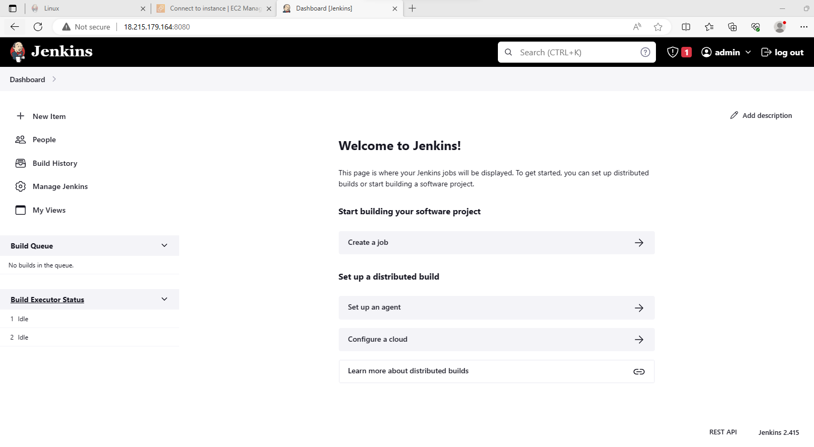
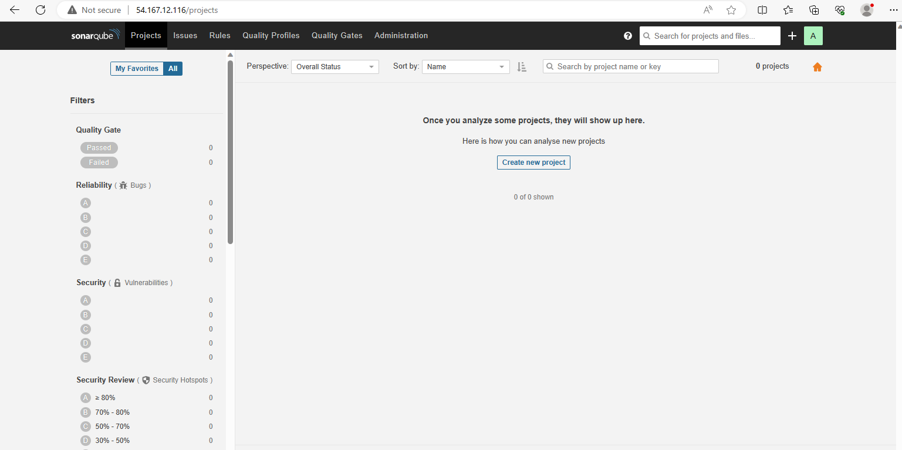
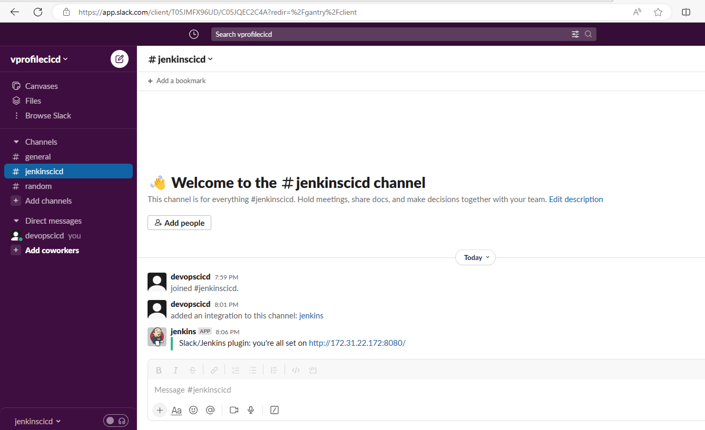

# Project-5: Continuous Integration Using jenkins, Nexus, Sonarqube and Slack

[*Project Source*](https://www.udemy.com/course/decodingdevops/learn/lecture/29851672#overview)

## Pre-requisities:

 * AWS Account
 * GitHub account
 * Jenkins
 * Nexus
 * SonarQube
 * Slack 


### Step-1: Log into AWS account and Create Key Pair

 - Create a keypair and download the private key to your local system. We will need this key to ssh into our servers.

### Step-2: Create Security Groups for Jenkins, Nexus and SonarQube

* Jenkins Security Group
 Configure inbound rule to allow ssh login on port 22 and Allow Jenkins on port 8080 from anywhere. We will be updating the Jenkins security group rule to allow traffic on port 8080 via the sonarqube security group.
```sh
Name: jenkins-SG
Allow: SSH from MyIP on port 22
Allow: 8080 from Anywhere 
```

* Nexus Security Group
 Configure inbound rule to allow ssh login on port 22, also configure port 8081 to be accessible from the browser and port 8081 from the the configured Jenkins-SG.
```sh
Name: Nexus-SG
Allow: SSH  on port 22 from MyIP
Allow: 8081 from MyIP and Jenkins-SG
```

* SonarQube Security Group
 Configure the inbound rule allow SSH on port 22, allow access from My IP on port 80 and also from the configure Jenkins-SG
```sh
Name: sonar-SG
Allow: SSH from MyIP
Allow: 80 from MyIP and Jenkins-SG
```

- Once `SonarQube-SG` is created edit Jenkins-SG inbound rule to allow traffic from sonarqube security group. This allows for sonarqube send results back to our Jenkins server.

### Step-3: Create EC2 instances for Jenkins, Nexus and SonarQube

#### Jenkins Server Setup

- Create `Jenkins-server` with below properties and userdata script.
```sh
Name: jenkins-server
AMI: Ubuntu 20.04
SecGrp: jenkins-SG
InstanceType: t2.small
KeyPair: Jenkins-key
Additional Details: userdata below
```

* Jenkins Userdata script
```sh
#!/bin/bash
sudo apt update
sudo apt install openjdk-11-jdk -y
sudo apt install maven -y
curl -fsSL https://pkg.jenkins.io/debian-stable/jenkins.io.key | sudo tee \
  /usr/share/keyrings/jenkins-keyring.asc > /dev/null
echo deb [signed-by=/usr/share/keyrings/jenkins-keyring.asc] \
  https://pkg.jenkins.io/debian-stable binary/ | sudo tee \
  /etc/apt/sources.list.d/jenkins.list > /dev/null
sudo apt-get update
sudo apt-get install jenkins -y
###
```



#### Nexus Server Setup

- Create `Nexus-server` with below properties and userdata script.
```sh
Name: nexus-server
AMI: centos7
InstanceType: t2.medium
SecGrp: Nexus-SG
KeyPair: NexusKey
Additional Details: userdata below
```

* Nexus Userdata script
```sh
#!/bin/bash
yum install java-1.8.0-openjdk.x86_64 wget -y   
mkdir -p /opt/nexus/   
mkdir -p /tmp/nexus/                           
cd /tmp/nexus/
NEXUSURL="https://download.sonatype.com/nexus/3/latest-unix.tar.gz"
wget $NEXUSURL -O nexus.tar.gz
EXTOUT=`tar xzvf nexus.tar.gz`
NEXUSDIR=`echo $EXTOUT | cut -d '/' -f1`
rm -rf /tmp/nexus/nexus.tar.gz
rsync -avzh /tmp/nexus/ /opt/nexus/
useradd nexus
chown -R nexus.nexus /opt/nexus 
cat <<EOT>> /etc/systemd/system/nexus.service
[Unit]                                                                          
Description=nexus service                                                       
After=network.target                                                            
                                                                  
[Service]                                                                       
Type=forking                                                                    
LimitNOFILE=65536                                                               
ExecStart=/opt/nexus/$NEXUSDIR/bin/nexus start                                  
ExecStop=/opt/nexus/$NEXUSDIR/bin/nexus stop                                    
User=nexus                                                                      
Restart=on-abort                                                                
                                                                  
[Install]                                                                       
WantedBy=multi-user.target                                                      

EOT

echo 'run_as_user="nexus"' > /opt/nexus/$NEXUSDIR/bin/nexus.rc
systemctl daemon-reload
systemctl start nexus
systemctl enable nexus
```


#### SonarQube Server Setup


- Create `sonar-server` with below properties and userdata script.
```sh
Name: sonar-server
AMI: Ubuntu 20.04
InstanceType: t2.medium
SecGrp: sonar-SG
KeyPair: sonarKey
Additional Details: userdata below
```

* Sonar Userdata script
```sh
#!/bin/bash
cp /etc/sysctl.conf /root/sysctl.conf_backup
cat <<EOT> /etc/sysctl.conf
vm.max_map_count=262144
fs.file-max=65536
ulimit -n 65536
ulimit -u 4096
EOT
cp /etc/security/limits.conf /root/sec_limit.conf_backup
cat <<EOT> /etc/security/limits.conf
sonarqube   -   nofile   65536
sonarqube   -   nproc    409
EOT

sudo apt-get update -y
sudo apt-get install openjdk-11-jdk -y
sudo update-alternatives --config java

java -version

sudo apt update
wget -q https://www.postgresql.org/media/keys/ACCC4CF8.asc -O - | sudo apt-key add -

sudo sh -c 'echo "deb http://apt.postgresql.org/pub/repos/apt/ `lsb_release -cs`-pgdg main" >> /etc/apt/sources.list.d/pgdg.list'
sudo apt install postgresql postgresql-contrib -y
#sudo -u postgres psql -c "SELECT version();"
sudo systemctl enable postgresql.service
sudo systemctl start  postgresql.service
sudo echo "postgres:admin123" | chpasswd
runuser -l postgres -c "createuser sonar"
sudo -i -u postgres psql -c "ALTER USER sonar WITH ENCRYPTED PASSWORD 'admin123';"
sudo -i -u postgres psql -c "CREATE DATABASE sonarqube OWNER sonar;"
sudo -i -u postgres psql -c "GRANT ALL PRIVILEGES ON DATABASE sonarqube to sonar;"
systemctl restart  postgresql
#systemctl status -l   postgresql
netstat -tulpena | grep postgres
sudo mkdir -p /sonarqube/
cd /sonarqube/
sudo curl -O https://binaries.sonarsource.com/Distribution/sonarqube/sonarqube-8.3.0.34182.zip
sudo apt-get install zip -y
sudo unzip -o sonarqube-8.3.0.34182.zip -d /opt/
sudo mv /opt/sonarqube-8.3.0.34182/ /opt/sonarqube
sudo groupadd sonar
sudo useradd -c "SonarQube - User" -d /opt/sonarqube/ -g sonar sonar
sudo chown sonar:sonar /opt/sonarqube/ -R
cp /opt/sonarqube/conf/sonar.properties /root/sonar.properties_backup
cat <<EOT> /opt/sonarqube/conf/sonar.properties
sonar.jdbc.username=sonar
sonar.jdbc.password=admin123
sonar.jdbc.url=jdbc:postgresql://localhost/sonarqube
sonar.web.host=0.0.0.0
sonar.web.port=9000
sonar.web.javaAdditionalOpts=-server
sonar.search.javaOpts=-Xmx512m -Xms512m -XX:+HeapDumpOnOutOfMemoryError
sonar.log.level=INFO
sonar.path.logs=logs
EOT

cat <<EOT> /etc/systemd/system/sonarqube.service
[Unit]
Description=SonarQube service
After=syslog.target network.target

[Service]
Type=forking

ExecStart=/opt/sonarqube/bin/linux-x86-64/sonar.sh start
ExecStop=/opt/sonarqube/bin/linux-x86-64/sonar.sh stop

User=sonar
Group=sonar
Restart=always

LimitNOFILE=65536
LimitNPROC=4096


[Install]
WantedBy=multi-user.target
EOT

systemctl daemon-reload
systemctl enable sonarqube.service
#systemctl start sonarqube.service
#systemctl status -l sonarqube.service
apt-get install nginx -y
rm -rf /etc/nginx/sites-enabled/default
rm -rf /etc/nginx/sites-available/default
cat <<EOT> /etc/nginx/sites-available/sonarqube
server{
    listen      80;
    server_name sonarqube.groophy.in;

    access_log  /var/log/nginx/sonar.access.log;
    error_log   /var/log/nginx/sonar.error.log;

    proxy_buffers 16 64k;
    proxy_buffer_size 128k;

    location / {
        proxy_pass  http://127.0.0.1:9000;
        proxy_next_upstream error timeout invalid_header http_500 http_502 http_503 http_504;
        proxy_redirect off;
              
        proxy_set_header    Host            \$host;
        proxy_set_header    X-Real-IP       \$remote_addr;
        proxy_set_header    X-Forwarded-For \$proxy_add_x_forwarded_for;
        proxy_set_header    X-Forwarded-Proto http;
    }
}
EOT
ln -s /etc/nginx/sites-available/sonarqube /etc/nginx/sites-enabled/sonarqube
systemctl enable nginx.service
#systemctl restart nginx.service
sudo ufw allow 80,9000,9001/tcp

echo "System reboot in 30 sec"
sleep 30
reboot
```


### Step-4: Post Installation Steps

####  Jenkins Server:

- SSH our jenkins server and validate the  status for Jenkins. 
- Get initialAdmin password from directory using below command
 `/var/lib/jenkins/secrets/initialAdminPassword` 
```sh
sudo -i
system status jenkins
cat /var/lib/jenkins/secrets/initialAdminPassword 
```


- Go to browser, `http://<public_ip_of_jenkins_server>:8080`, enter initialAdminPasswrd. We will also install suggested plugins. Then we will create our first admin user.

- install below plugins for Jenkins.
```sh
Maven Integration
Github Integration
Nexus Artifact Uploader
SonarQube Scanner
Slack Notification
Build Timestamp
NodeJs
```

#### For Nexus Server:

-  SSH into nexus server and validate system status for nexus.
```sh
sudo -i
systemctl status nexus
```

- Go to browser, `http://<public_ip_of_nexus_server>:8081` ,click on sign-in. Initial password will be located `/opt/nexus/sonatype-work/nexus3/admin.password`
```sh
cat /opt/nexus/sonatype-work/nexus3/admin.password
```

- Username is `admin`, paste password from previous step to setup  new password and select `Disable Anonymous Access`.

- Select gear symbol and create repository. This repo will be used to store our release artifacts.

```sh
maven2 hosted
Name: vprofile-release
Version policy: Release
```

- Create a maven2 proxy repository. Maven will store the dependecies in this repository, whenever we need any dependency for the  project it will check this proxy repo in Nexus first and download it for project. 

```sh
maven2 proxy
Name: vpro-maven-central
remote storage: https://repo1.maven.org/maven2/
```

- Any artifact with `-SNAPSHOT` extension will be stored in this repository.

```sh
maven2 hosted
Name: vprofile-snapshot
Version policy: Snapshot
```

- Last repo, will be `maven2 group` type. We will use this repo to group all maven repositories.

```sh
maven2 group
Name: vpro-maven-group
Member repositories: 
 - vpro-maven-central
 - vprofile-release
 - vprofile-snapshot
```


#### For SonarQube Server:

- ssh into  Sonarqube server and validate sonar service status. Status should be active (running), http://<public_ip_of_sonar_server>.

- Login with username `admin` and password `admin`.


### Step-5: Create a repository in Github

- We need to create a private repository in the Github to be used with this project. 

- Clone the content from link below:
```sh
https://github.com/hkhcoder/vprofile-project.git
```

### Step-6: Build Job with Nexus Integration 

- We will require some dependencies to build our job on Jenkins server. This include JDK8 and Maven.

- Since our application is using JDK8, we need to install Java8 in jenkins. `Manage Jenkins` -> `Global Tool Configuration`
We will install JDK8 manually, and specify its PATH in here.
```sh
Under JDK -> Add JDK
Name: OracleJDK8
untick Install Automatically
JAVA_HOME: 
```

- Currently our jenkins has JDK-11 install, we can SSH into our jenkins server and install JDK-8. Then get the PATH to JDK-8 to replace in above step. So after installation we will see our `JAVA_HOME` for JDK-8 is `/usr/lib/jvm/java-8-openjdk-amd64`

```sh
sudo apt update -y
sudo apt install openjdk-8-jdk -y
sudo -i
ls /usr/lib/jvm
### we should get both jdk-11 and jdk-8 in this path ###
java-1.11.0-openjdk-amd64  java-11-openjdk-amd64  openjdk-11
java-1.8.0-openjdk-amd64   java-8-openjdk-amd64
``` 

- Next we will setup  Maven.
```sh
Name: MAVEN3
version : default
``` 

- Add Nexus login credentials to Jenkins. Go to `Manage Jenkins` -> `Manage Credentials` ->  `Global` -> `Add Credentials`

```sh
username: admin
password: <pwd_setup_for_nexus>
ID: nexuslogin
description: nexuslogin
``` 

- Create Jenkinsfile for Build pipeline as below. 
  Update Pipeline file and push to GitHub.
```sh
pipeline {
 agent any
 tools {
     maven "MAVEN3"
     jdk "OracleJDK8"
 }

 stages {
     stage('Fetch code') {
            steps {
               git branch: 'vp-rem', url: 'https://github.com/devopshydclub/vprofile-repo.git'
            }

     }

     stage('Build'){
         steps{
            sh 'mvn install -DskipTests'
         }

         post {
            success {
               echo 'Now Archiving it...'
               archiveArtifacts artifacts: '**/target/*.war'
            }
         }
     }

     stage('UNIT TEST') {
            steps{
                sh 'mvn test'
            }
        }
 }
}
```

-  Build pipeline is successful!


### Step-7: Setup GitHub Webhook and update Jenkins Job

- Add GitHub webhook to  repository so when a new commit is made by a developer, build pipeline will be triggered automatically.

- Go to Github repository, `Settings` -> `Webhooks` -> Add `JenkinsURL` with `/github-webhook/` at the end.


  

### Step-8: Code Analysis with SonarQube

- The Unit test/Code Coverage reports are generated under Jenkins workspace target directory. But these reports are not human readable. We need a tool which can scan and analyze the coed and present it in human readable format in a Dashboard. We will use SonarQube solution of this problem. 
Two things need to setup:
 * SonarScanner tool in Jenkins to scan the code
 * We need SonarQube information in jenkins so that Jenkins will know where to upload these reports

- Lets start with SonarScanner tool configuration. Go to `Manage Jenkins` -> `Global Tool Configuration`
```sh
Add sonar scanner
name: sonarscanner
tick install automatically
```
- Navigate to `Configure System`, and find ` SonarQube servers` section
```sh
tick environment variables
Add sonarqube
Name: sonarserver
Server URL: http://<private_ip_of_sonar_server>
Server authentication token: we need to create token from sonar website
```


- Add sonar token to global credentials.
```sh
Kind: secret text
Secret: <paste_token>
name: sonartoken
description: sonartoken
```


- Add a post action for checkstyle analysis to the pipeline script and commit/push changes to GitHub.

```sh
pipeline {
    agent any 

    stages{
       stage('Fetch code') {
        steps{
          git branch: 'vp-rem', url: 'https://github.com/devopshydclub/vprofile-repo.git'
        }
       }

       stage('Build') {
         steps {
            sh 'mvn clean install -DskipTests'
         }
         post {
           success {
              echo "Now Archiving."
              archiveArtifacts artifacts: '**/*.war'
           }
         }
       }
       stage(Test){
          steps {
            sh 'mvn test'
          }

       }

       stage('Checkstyle Analysis'){
        steps {
           sh 'mvn checkstyle:checkstyle'
        }
       }
       
    }
}
```


- Add sonarQube code for our pipeline and commit/push changes to GitHub.
```sh
stage('Sonar Analysis') {
            environment {
                scannerHome = tool 'sonar4.8'
            }
            steps {
               withSonarQubeEnv('sonar') {
                   sh '''${scannerHome}/bin/sonar-scanner -Dsonar.projectKey=vprofile \
                   -Dsonar.projectName=vprofile \
                   -Dsonar.projectVersion=1.0 \
                   -Dsonar.sources=src/ \
                   -Dsonar.java.binaries=target/test-classes/com/visualpathit/account/controllerTest/ \
                   -Dsonar.junit.reportsPath=target/surefire-reports/ \
                   -Dsonar.jacoco.reportsPath=target/jacoco.exec \
                   -Dsonar.java.checkstyle.reportPaths=target/checkstyle-result.xml'''
              }
            }
        }

    }
}
```

- Our job is completed succesfully.


- We can see quality gate results in SonarQube server.


- Create a Webhook in SonarQube to send the anaylysis results to jenkins.

```sh
http://<private_ip_of_jenkins>:8080/sonarqube-webhook
```

- We will add below stage to our pipeline and commit changes to Github.

```sh
stage("Quality Gate") {
            steps {
                timeout(time: 1, unit: 'HOURS') {
                    // Parameter indicates whether to set pipeline to UNSTABLE if Quality Gate fails
                    // true = set pipeline to UNSTABLE, false = don't
                    waitForQualityGate abortPipeline: true
                }
            }
        }

    }
}
```


- We can see BUILD is successful!


### Step-9: Publish Artifact to Nexus Repository

- In this step, automate process of publishing latest artifact to Nexus repository after successful build. 
We need to add Build-Timestamp to artifact name to get unique artifact each time. We can go to `Manage Jenkins` -> `Configure System` under `Build Timestamp` we can update the pattern as our wish.

```sh
yy-MM-dd_HHmm
```

- Add below stage to the  pipeline and see results.
```sh
stage('UPLOAD ARTIFACT') {
                steps {
                    nexusArtifactUploader(
                        nexusVersion: 'nexus3',
                        protocol: 'http',
                        nexusUrl: "${NEXUSIP}:${NEXUSPORT}",
                        groupId: 'QA',
                        version: "${env.BUILD_ID}-${env.BUILD_TIMESTAMP}",
                        repository: "${RELEASE_REPO}",
                        credentialsId: ${NEXUS_LOGIN},
                        artifacts: [
                            [artifactId: 'vproapp' ,
                            classifier: '',
                            file: 'target/vprofile-v2.war',
                            type: 'war']
                        ]
                    )
                }
        }
```

- Build is successful.
  


- Artifact is uploaded to Nexus repository.


### Step-10: Slack Notification

- Login to slack and create a workspace by following the prompts. Then create a channel `jenkins-cicd` in our workspace.

- Next, add jenkins app to slack. Search in Google with `Slack apps`. Then search for `jenkins` add to Slack, choose the channel `jenkins-cicd`. It will give us to setup instructions, from there copy `Integration token credential ID` .


- Go to Jenkins dashboard `Configure system` -> `Slack`
```sh
Workspace:  example (in the workspace url example.slack.com)
credential: slacktoken 
default channel: #jenkins-cicd
```
-  Add sonar token to global credentials.
```sh
Kind: secret text
Secret: <paste_token>
name: slacktoken
description: slacktoken
```



- Add below code to  Jenkinsfile in the same level with stages and push for changes.
```sh
post{
        always {
            echo 'Slack Notifications'
            slackSend channel: '#jenkinscicd',
                color: COLOR_MAP[currentBuild.currentResult],
                message: "*${currentBuild.currentResult}:* Job ${env.JOB_NAME} build ${env.BUILD_NUMBER} \n More info at: ${env.BUILD_URL}"
        }
    }
```


-  Notification was sent and received on slack.

Step 11-:CLEAN UP
- Delete all resources created throughout the project.
